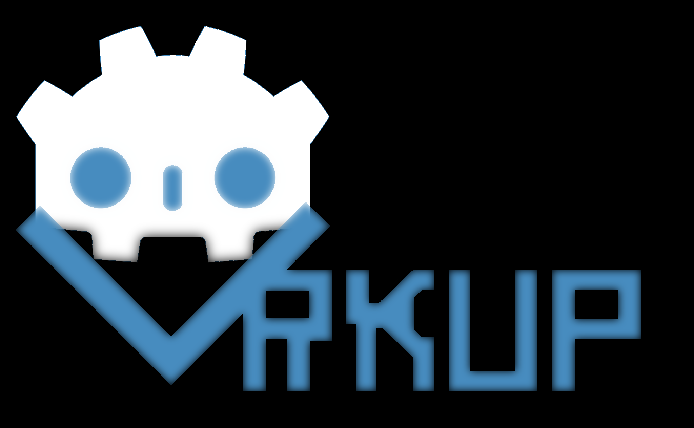

**GodArkup — Declarative UI Markup for Godot**



A Godot EditorPlugin that enables UI scene creation via a lightweight XML‑based markup language. Define your UI structure, resource references, data bindings, and dynamic loops in a single `.godarkup` file; then generate a `.tscn` scene or preview it instantly from the Godot Editor.

---

## Features

- **Declarative XML‑based UI definition**: Define nodes, properties, and child hierarchies in a human‑readable markup format.
- **Resource embedding**: Collect textures, themes, fonts, and other assets with a dedicated `<Resources>` block.
- **Dynamic Property Interpolation**: Display values from game objects or context using `#{expression}` syntax. Supports `#{object_id.property}`.
- **Reactive Data Bindings**: Bind UI properties to game objects’ properties or signals using `{expression}` syntax:
  - `{object_id.property}` — one‑time initialization of the UI property from the object's property.
  - `{object_id.property:signal_name}` — automatic updates of the UI property when `signal_name` is emitted by `object_id`.
- **Dynamic For Loops**: Create lists of UI elements that automatically update when their `count` binding changes.
- **Event Handling**: Wire UI events to script callbacks using `on_<signal>="object_id.method_name"`.
- **Preview panel**: Live preview your markup directly within the Editor’s **bottom dock**.
- **Scene generation**: To generate a `.tscn` scene from a `.godarkup` file, select the file in the FileSystem dock and go to **Tools -> Generate UI Scene**.

## Installation

1. **Download the plugin:** Obtain the plugin from its release page or by cloning the repository.
2. **Copy to your project:** Extract the `addons/godarkup/` folder (from the downloaded ZIP or repository) directly into your Godot project's `res://addons/` directory.
3. **Enable the plugin:** In Godot, go to **Project -> Project Settings -> Plugins**, and enable **GodArkup**.
4. **Verify file recognition:** `.godarkup` files should now be recognized and visible in the FileSystem dock (this is handled automatically by the plugin).

## Syntax Overview

### Root Structure

```xml
<Resources> … </Resources>
<Properties> … </Properties>
<RootNode …> … </RootNode>
```

- `<Resources>`: Declare asset `id` and `path` pairs.
- `<Properties>`: Define properties that can be passed to nested GodArkup components.
- **UI Elements**: Any Godot `Node` type as XML tags. Attributes map to properties or signal‐handlers.

### Resource Block

```xml
<Resources>
  <ImageTexture id="icon" path="res://assets/icon.svg" />
  <Theme id="app_theme"   path="res://assets/theme.tres" />
  <Font id="custom_font"  path="res://assets/font.tres" />
</Resources>
```

### Property Interpolation (`#{...}`)

Used to display dynamic values within text or other properties. The expression is evaluated once when the UI is built. If the expression contains a binding (`{...}`), its initial value will be used, and a reactive binding will be set up.

**Limitations:**
- Nested interpolation is not supported (e.g., `#{#{...}}` will not work).

- `#{variable_name}`: Interpolates a variable from the current context (e.g., loop variable).
- `#{object_id.property}`: Interpolates a property from a game object found by its external ID.

Example:

```xml
<Label text="Player Name: #{player_data.name}" />
<Label text="Current Slot: #{i + 1}" /> <!-- 'i' from a <for> loop -->
<Label text="Health: #{player.health:health_changed}" /> <!-- Displays initial health, updates on signal -->
```

### Reactive Data Binding (`{...}`)

Used to bind a UI property directly to a game object's property, with optional reactive updates.

**Limitations:**
- Bindings must be the *only* content of an attribute's value (e.g., `text="{player.name}"` is supported, but `text="Player: {player.name}"` is not).

- `{object_id.property}`: Initializes the UI property with the value of `object_id.property`.
- `{object_id.property:signal_name}`: Initializes the UI property and updates it automatically when `signal_name` is emitted by `object_id`.

Example:

```xml
<ProgressBar
	min="0"
	max_value="{player.max_health}"
	value="{player.health:health_changed}"
	theme="app_theme"
	custom_minimum_size="60;0"
	size_flags_vertical="3" />
```

### Dynamic For Loops (`<for>`)

Creates a list of UI elements based on a `count`. The loop can dynamically update its children when the `count` binding changes.

**Limitations:**
- Children of `<for>` loops are not previewed in the Godot editor; they will only appear at runtime.

- `count="{number}"`: Static count.
- `count="{object_id.property}"`: Initial count from property.
- `count="{object_id.property:signal_name}"`: Initial count from property, and dynamically updates when `signal_name` is emitted.
- `var="variable_name"`: The name of the loop variable (e.g., `i`).

Example:

```xml
<VBoxContainer name="InventorySlots">
	<for count="{player_inv.inventory_size:inventory_size_changed}" var="i">
		<PanelContainer custom_minimum_size="0;50">
			<Label text="Slot #{i + 1}" align="1" valign="1" />
		</PanelContainer>
	</for>
</VBoxContainer>
```

### Event Handling

Use `on_<signal>="object_id.method_name"` to wire UI events to script callbacks. The `object_id` is resolved by its external ID.

```xml
<Button text="Click Me" on_pressed="player.open_menu" />
```

## 📂 Example Markup

```xml
<Resources>
  <Theme id="main_theme" path="res://assets/theme.tres"/>
</Resources>
<VBoxContainer>
  <Label text="Inventory Size: #{player_inv.inventory_size:inventory_size_changed}" />
  <HBoxContainer>
	<Button text="Add Item" on_pressed="player_inv.add_item" />
	<Button text="Remove Item" on_pressed="player_inv.remove_item" />
  </HBoxContainer>
  <ScrollContainer size_flags_vertical="3">
	<VBoxContainer name="InventorySlots">
	  <for count="{player_inv.inventory_size:inventory_size_changed}" var="i">
		<PanelContainer custom_minimum_size="0;50">
		  <Label text="Slot #{i + 1}" align="1" valign="1" />
		</PanelContainer>
	  </for>
	</VBoxContainer>
  </ScrollContainer>
</VBoxContainer>
```

## Usage

1. **Edit** your `.godarkup` file in the FileSystem dock.
2. **Select** the file and click **Tools ▶️ Generate UI Scene**.
3. A new `.tscn` will be created alongside the `.godarkup` file.
4. **Preview** live: open the **UI Markup Preview** panel at the bottom. To update the preview after making changes to the `.godarkup` file, **double-click the file in the FileSystem dock** (even if it's already open in the script editor).


## License

MIT License. See [LICENSE](LICENSE.md) for details.
